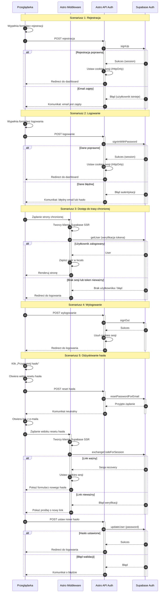

```mermaid
sequenceDiagram
    autonumber
    
    participant Browser as Przeglądarka
    participant Middleware as Astro Middleware
    participant ApiAuth as Astro API Auth
    participant Supabase as Supabase Auth

    Note over Browser, Supabase: Scenariusz 1: Rejestracja

    Browser->>Browser: Wypełnia formularz rejestracji
    Browser->>ApiAuth: POST rejestracja
    activate ApiAuth
    
    ApiAuth->>Supabase: signUp
    activate Supabase
    
    alt Rejestracja poprawna
        Supabase-->>ApiAuth: Sukces (session)
        ApiAuth->>ApiAuth: Ustaw cookies sesji (HttpOnly)
        ApiAuth-->>Browser: Redirect do dashboard
    else Email zajęty
        Supabase-->>ApiAuth: Błąd (użytkownik istnieje)
        ApiAuth-->>Browser: Komunikat: email jest zajęty
    end
    
    deactivate Supabase
    deactivate ApiAuth

    Note over Browser, Supabase: Scenariusz 2: Logowanie

    Browser->>Browser: Wypełnia formularz logowania
    Browser->>ApiAuth: POST logowanie
    activate ApiAuth
    
    ApiAuth->>Supabase: signInWithPassword
    activate Supabase
    
    alt Dane poprawne
        Supabase-->>ApiAuth: Sukces (session)
        ApiAuth->>ApiAuth: Ustaw cookies sesji (HttpOnly)
        ApiAuth-->>Browser: Redirect do dashboard
    else Dane błędne
        Supabase-->>ApiAuth: Błąd autentykacji
        ApiAuth-->>Browser: Komunikat: błędny email lub hasło
    end
    
    deactivate Supabase
    deactivate ApiAuth

    Note over Browser, Supabase: Scenariusz 3: Dostęp do trasy chronionej

    Browser->>Middleware: Żądanie strony chronionej
    activate Middleware
    
    Middleware->>Middleware: Tworzy klienta Supabase SSR
    Middleware->>Supabase: getUser (weryfikacja tokena)
    activate Supabase
    
    alt Użytkownik zalogowany
        Supabase-->>Middleware: User
        Middleware->>Middleware: Zapisz user w locals
        Middleware-->>Browser: Renderuj stronę
    else Brak sesji lub token nieważny
        Supabase-->>Middleware: Brak użytkownika / błąd
        Middleware-->>Browser: Redirect do logowania
    end
    
    deactivate Supabase
    deactivate Middleware

    Note over Browser, Supabase: Scenariusz 4: Wylogowanie

    Browser->>ApiAuth: POST wylogowanie
    activate ApiAuth
    ApiAuth->>Supabase: signOut
    activate Supabase
    Supabase-->>ApiAuth: Sukces
    ApiAuth->>ApiAuth: Usuń cookies sesji
    ApiAuth-->>Browser: Redirect do logowania
    deactivate Supabase
    deactivate ApiAuth

    Note over Browser, Supabase: Scenariusz 5: Odzyskiwanie hasła

    Browser->>Browser: Klik „Przypomnij hasło”
    Browser->>Browser: Otwiera widok resetu hasła

    Browser->>ApiAuth: POST reset hasła
    activate ApiAuth
    ApiAuth->>Supabase: resetPasswordForEmail
    activate Supabase
    Supabase-->>ApiAuth: Przyjęto żądanie
    ApiAuth-->>Browser: Komunikat neutralny
    deactivate Supabase
    deactivate ApiAuth

    Browser->>Browser: Otwiera link z e-maila
    Browser->>Middleware: Żądanie widoku resetu hasła
    activate Middleware
    Middleware->>Middleware: Tworzy klienta Supabase SSR
    Middleware->>Supabase: exchangeCodeForSession
    activate Supabase

    alt Link ważny
        Supabase-->>Middleware: Sesja recovery
        Middleware->>Middleware: Ustaw cookies sesji
        Middleware-->>Browser: Pokaż formularz nowego hasła
    else Link nieważny
        Supabase-->>Middleware: Błąd weryfikacji
        Middleware-->>Browser: Pokaż prośbę o nowy link
    end

    deactivate Supabase
    deactivate Middleware

    Browser->>ApiAuth: POST ustaw nowe hasło
    activate ApiAuth
    ApiAuth->>Supabase: updateUser (password)
    activate Supabase
    alt Hasło ustawione
        Supabase-->>ApiAuth: Sukces
        ApiAuth-->>Browser: Redirect do logowania
    else Błąd walidacji
        Supabase-->>ApiAuth: Błąd
        ApiAuth-->>Browser: Komunikat o błędzie
    end
    deactivate Supabase
    deactivate ApiAuth
```
