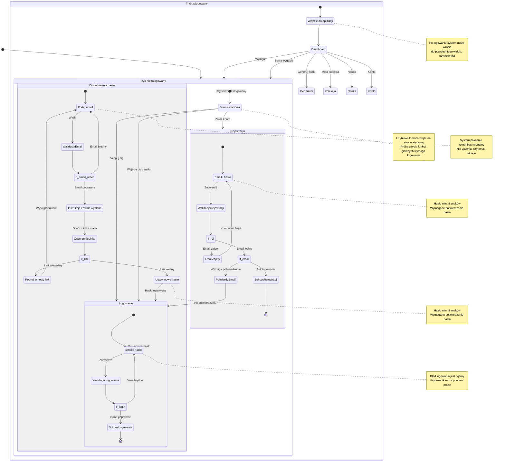

## Podróż użytkownika – logowanie, rejestracja, odzyskiwanie hasła

```mermaid
stateDiagram-v2
  [*] --> Guest

  state "Tryb niezalogowany" as Guest {
    [*] --> StronaStartowa

    StronaStartowa: Strona startowa
    note right of StronaStartowa
      Użytkownik może wejść na stronę startową
      Próba użycia funkcji głównych wymaga logowania
    end note

    StronaStartowa --> Logowanie: Zaloguj się
    StronaStartowa --> Rejestracja: Załóż konto
    StronaStartowa --> Logowanie: Wejście do panelu

    state "Logowanie" as Logowanie {
      [*] --> FormularzLogowania
      FormularzLogowania: Email i hasło
      note right of FormularzLogowania
        Błąd logowania jest ogólny
        Użytkownik może ponowić próbę
      end note
      FormularzLogowania --> WalidacjaLogowania: Zatwierdź
      WalidacjaLogowania --> if_login
      state if_login <<choice>>
      if_login --> SukcesLogowania: Dane poprawne
      if_login --> FormularzLogowania: Dane błędne
      FormularzLogowania --> ResetHasla: Przypomnij hasło
      SukcesLogowania --> [*]
    }

    state "Rejestracja" as Rejestracja {
      [*] --> FormularzRejestracji
      FormularzRejestracji: Email i hasło
      note right of FormularzRejestracji
        Hasło min. 8 znaków
        Wymagane potwierdzenie hasła
      end note
      FormularzRejestracji --> WalidacjaRejestracji: Zatwierdź
      WalidacjaRejestracji --> if_rej
      state if_rej <<choice>>
      if_rej --> EmailZajety: Email zajęty
      if_rej --> if_email: Email wolny
      EmailZajety --> FormularzRejestracji: Komunikat błędu
      state if_email <<choice>>
      if_email --> SukcesRejestracji: Autologowanie
      if_email --> PotwierdzEmail: Wymaga potwierdzenia
      PotwierdzEmail --> Logowanie: Po potwierdzeniu
      SukcesRejestracji --> [*]
    }

    state "Odzyskiwanie hasła" as ResetHasla {
      [*] --> FormularzResetu
      FormularzResetu: Podaj email
      note right of FormularzResetu
        System pokazuje komunikat neutralny
        Nie ujawnia, czy email istnieje
      end note

      FormularzResetu --> WalidacjaEmail: Wyślij
      WalidacjaEmail --> if_email_reset
      state if_email_reset <<choice>>
      if_email_reset --> FormularzResetu: Email błędny
      if_email_reset --> PotwierdzenieWysylki: Email poprawny

      PotwierdzenieWysylki: Instrukcja została wysłana
      PotwierdzenieWysylki --> OtworzenieLinku: Otwórz link z maila

      OtworzenieLinku --> if_link
      state if_link <<choice>>
      if_link --> ProsbaONowyLink: Link nieważny
      if_link --> UstawNoweHaslo: Link ważny

      ProsbaONowyLink: Poproś o nowy link
      ProsbaONowyLink --> FormularzResetu: Wyślij ponownie

      UstawNoweHaslo: Ustaw nowe hasło
      note right of UstawNoweHaslo
        Hasło min. 8 znaków
        Wymagane potwierdzenie hasła
      end note
      UstawNoweHaslo --> Logowanie: Hasło ustawione
    }
  }

  Guest --> App: Użytkownik zalogowany

  state "Tryb zalogowany" as App {
    [*] --> Wejscie

    Wejscie: Wejście do aplikacji
    note right of Wejscie
      Po logowaniu system może wrócić
      do poprzedniego widoku użytkownika
    end note

    Wejscie --> Dashboard
    Dashboard --> Generator: Generuj fiszki
    Dashboard --> Kolekcja: Moja kolekcja
    Dashboard --> Nauka: Nauka
    Dashboard --> Konto: Konto

    Dashboard --> Guest: Wyloguj
    Dashboard --> Guest: Sesja wygasła
  }
```

