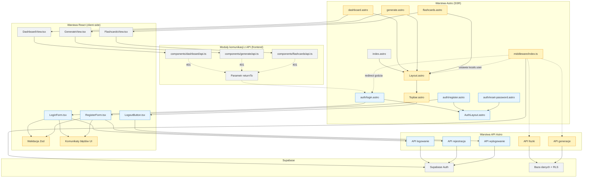

## Architektura UI – logowanie i rejestracja

```mermaid
flowchart TD
  %% Style
  classDef new fill:#e7f5ff,stroke:#1c7ed6,stroke-width:1px;
  classDef updated fill:#fff3bf,stroke:#f08c00,stroke-width:1px;
  classDef existing fill:#f1f3f5,stroke:#868e96,stroke-width:1px;

  %% ============= Astro SSR =============
  subgraph AstroSSR["Warstwa Astro (SSR)"]
    LAYOUT["Layout.astro"]:::updated
    TOPBAR["Topbar.astro"]:::updated
    AUTHLAYOUT["AuthLayout.astro"]:::new
    MW["middleware/index.ts"]:::updated

    P_INDEX["index.astro"]:::existing
    P_DASH["dashboard.astro"]:::updated
    P_GEN["generate.astro"]:::updated
    P_FC["flashcards.astro"]:::updated

    P_LOGIN["auth/login.astro"]:::new
    P_REG["auth/register.astro"]:::new
    P_RESET["auth/reset-password.astro"]:::new
  end

  %% ============= React islands =============
  subgraph ReactUI["Warstwa React (client-side)"]
    V_DASH["DashboardView.tsx"]:::existing
    V_GEN["GenerateView.tsx"]:::existing
    V_FC["FlashcardsView.tsx"]:::existing

    F_LOGIN["LoginForm.tsx"]:::new
    F_REG["RegisterForm.tsx"]:::new
    BTN_LOGOUT["LogoutButton.tsx"]:::new

    ZOD["Walidacja Zod"]:::updated
    ERR_UI["Komunikaty błędów UI"]:::updated
  end

  %% ============= Frontend API clients =============
  subgraph ApiClients["Moduły komunikacji z API (frontend)"]
    C_DASH["components/dashboard/api.ts"]:::existing
    C_GEN["components/generate/api.ts"]:::existing
    C_FC["components/flashcards/api.ts"]:::existing
    RTO["Parametr returnTo"]:::existing
  end

  %% ============= Astro API =============
  subgraph AstroAPI["Warstwa API Astro"]
    A_LOGIN["API logowanie"]:::new
    A_REG["API rejestracja"]:::new
    A_LOGOUT["API wylogowanie"]:::new

    A_FC["API fiszki"]:::updated
    A_GEN["API generacje"]:::updated
  end

  %% ============= Supabase =============
  subgraph SupabaseLayer["Supabase"]
    SB_AUTH["Supabase Auth"]:::existing
    SB_DB["Baza danych + RLS"]:::existing
  end

  %% ============= Page composition =============
  P_INDEX --> LAYOUT
  P_DASH --> LAYOUT
  P_GEN --> LAYOUT
  P_FC --> LAYOUT
  LAYOUT --> TOPBAR

  P_LOGIN --> AUTHLAYOUT
  P_REG --> AUTHLAYOUT
  P_RESET --> AUTHLAYOUT

  %% React islands mounting
  P_DASH --> V_DASH
  P_GEN --> V_GEN
  P_FC --> V_FC

  P_LOGIN --> F_LOGIN
  P_REG --> F_REG
  TOPBAR --> BTN_LOGOUT

  %% Validation + errors
  F_LOGIN --> ZOD
  F_REG --> ZOD
  F_LOGIN --> ERR_UI
  F_REG --> ERR_UI

  %% Client-side data fetching + redirects
  V_DASH --> C_DASH
  V_GEN --> C_GEN
  V_FC --> C_FC

  C_DASH -. "401" .-> RTO
  C_GEN -. "401" .-> RTO
  C_FC -. "401" .-> RTO
  RTO -.-> P_LOGIN

  %% Auth actions
  F_LOGIN --> A_LOGIN
  F_REG --> A_REG
  BTN_LOGOUT --> A_LOGOUT

  %% Protected pages guard (SSR)
  MW --> SB_AUTH
  MW -. "ustawia locals.user" .-> LAYOUT
  MW -. "redirect gościa" .-> P_LOGIN

  %% Auth API to Supabase
  A_LOGIN --> SB_AUTH
  A_REG --> SB_AUTH
  A_LOGOUT --> SB_AUTH

  %% App APIs to DB (z tożsamością z sesji)
  A_FC --> SB_DB
  A_GEN --> SB_DB
  MW -.-> A_FC
  MW -.-> A_GEN
```

